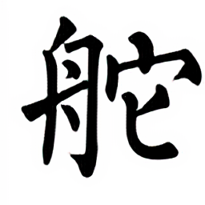

# 字体超分辨
> 超分辨模糊的字体图片，使其清晰没有锯齿。

<span>
 
</span>

## 使用步骤
### 准备数据集
1. 准备一些 ttf 字体文件，放到 `archive/ttf_10` 下面。
2. 运行脚本生成数据集：`python generate_dataset.py`

### 训练模型
```shell
python train.py --dataroot ./archive/FONT_SR_64to256_ttf_10_test3 \
--name super_font_cyclegan --model cycle_gan
```

### 进行推断
```shell
python infer.py --name super_font_cyclegan --model cycle_gan \
--dataroot data_path 
```

### 后处理
二值化，并转成 RGBA 图片：`python post_process.py`

## 其他
代码基于：https://github.com/junyanz/pytorch-CycleGAN-and-pix2pix